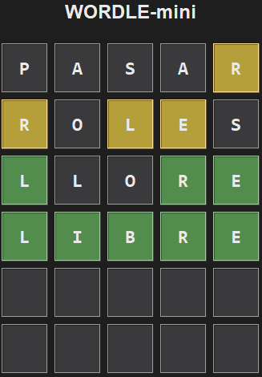

# 🎯 Proyecto de Laboratorio: Wordle
## Fundamentos de Programación 1. Grado en Ingeniería Informática – Inteligencia Artificial (Universidad de Sevilla)

En este laboratorio vas a completar la implementación de **un juego de adivinar palabras llamado Wordle**. 
Este juego fue creado por Josh Wardle en 2021, haciéndose viral a través de Twitter. Consiste en adivinar una **palabra de cinco letras** en un máximo de 6 intentos. En cada intento, el usuario introduce la palabra que considere, y el juego coloreará de verde, amarillo o gris cada letra de la palabra introducida: 

* **Verde** indica que la letra es correcta y que está en la posición correcta
* **Amarillo** significa que la letra está en la palabra secreta pero no en la posición correcta.
* **Gris** indica que la letra no está en la palabra secreta.

Observa el siguiente ejemplo, en el que se muestran las cuatro palabras que ha introducido el usuario (de arriba a abajo) hasta averiguar la palabra correcta (que en este caso era **libre**):



En la primera palabra, la única letra correcta fue la `R`, aunque no estaba en la posición correcta. En el segundo intento, hubo tres letras correctas, ninguna de ellas en su sitio. En el tercer intento, tenemos tres letras correctas que además están en la posición correcta. Por último, el usuario ha introducido la palabra correcta, que se marca entera en verde. El juego concluye y el jugador ha ganado. 

Observa que cuando el jugador introdujo la palabra `LLORE`, la segunda `L` no fue coloreada de amarillo, a pesar de ser una letra que sí pertenece a la palabra secreta. Esto es porque ya hay otra `L` en la palabra introducida por el usuario, y en la palabra secreta sólo hay una `L`. Si esta segunda `L` hubiese sido marcada en amarillo, el juego estaría indicándonos que la palabra secreta contiene dos o más `L`. 

---

Ya se dispone de la interfaz gráfica del juego, pero aún es necesario **implementar algunas funciones para que el juego funcione correctamente. Esta será tu tarea.**

---

## Preparación del entorno

👉 Para configurar Git y clonar el repositorio del laboratorio, consulta **[instrucciones_git.md](https://github.com/FP1-25-26/FP1-LAB01-Calculadora-de-viajes-espaciales/blob/main/instrucciones_git.md)**.  

---

## ⏱ Duración estimada

2 horas

---

## ✅ ¿Qué se practica?

- Tipos `str` y `datetime`
- Expresiones y operadores
- Condicionales `if`
- Bucles `for` con `range`
- Tipado de funciones
- Pruebas mediante `assert`

---

## 📁 Archivos del proyecto

Dispones de estos archivos en `src`:

| Archivo                  | Qué hace                                                                  |
|--------------------------|---------------------------------------------------------------------------|
| `wordle_gui.py`      | Implementación de la interfaz gráfica del juego. Contiene el programa principal: debes ejecutar este módulo para probar el juego. **No tienes que tocar nada de este módulo**.|
| `wordle_utils.py`      | Funciones auxiliares usadas por `wordle_gui`. **Debes implementarlas tal como te va pidiendo cada ejercicio, para que el juego se pueda ejecutar correctamente**.  |
| `wordle_utils_test.py`      | Pruebas de las funciones contenidas en `wordle_utils`.  **Debes ir completando las pruebas que se te irán pidiendo en cada ejercicio**.|
---


## 📌 Ejercicio 1: Comprobación de palabra introducida correcta

Cada vez que el usuario introduce una palabra, la aplicación comprobará que la palabra se adapta a las normas del juego: **debe tener exactamente cinco letras**. 

Implementa en `wordle_utils.py` la función `es_palabra_valida` que lleva a cabo esta comprobación. Para asegurarte de que tu implementación es correcta, añade el siguiente código en el módulo `wordle_utils_test.py`:

```python
from wordle_utils import es_palabra_valida

def test_es_palabra_valida():
    print("Probando es_palabra_valida...")
    assert es_palabra_valida("casar") == True
    assert es_palabra_valida("casa") == False
    assert es_palabra_valida("casarr") == False
    assert es_palabra_valida("c4sar") == False
    assert es_palabra_valida("casa ") == False
    assert es_palabra_valida(" casa") == False
    assert es_palabra_valida("CASAR") == True

test_es_palabra_valida()
print("✅Todas las pruebas pasaron correctamente.")
```

Ejecuta las pruebas y comprueba que todas pasan correctamente.

## 📌 Ejercicio 2: Cálculo del tiempo de juego

El juego almacena la fecha y hora en la que el jugador comienza una partida. Cuando el jugador consigue acertar la palabra, el juego le muestra **el tiempo que ha tardado**.

Para dar soporte a esta funcionalidad, implementa la función `calcula_minutos_y_segundos`, que recibe dos parámetros `inicio` y `final` de tipo `datetime`, y devuelve los minutos y segundos que transcurren entre ambos. 

Observa los siguientes ejemplos de llamadas a la función `calcula_minutos_y_segundos`: 

```
>>> calcula_minutos_y_segundos(datetime(2024, 1, 1, 23, 0, 0), datetime(2024, 1, 1, 23, 0, 30))
(0, 30)
>>> calcula_minutos_y_segundos(datetime(2024, 1, 1, 23, 0, 0), datetime(2024, 1, 1, 23, 3, 45))
(3, 45)
>>> calcula_minutos_y_segundos(datetime(2024, 1, 1, 23, 0, 0), datetime(2024, 1, 2, 0, 1, 15))
(61, 15)
```

Para probar la función, implementa una función `test_calcula_minutos_y_segundos` en el módulo `wordle_utils_tests.py`, en el que se pruebe mediante `assert` cada uno de los casos de pruebas mostrados en el ejemplo anterior. **Ejecuta las pruebas y comprueba que tu implementación las pasa todas correctamente.**


## 📌 Ejercicio 3: Obtención de pistas

Queremos disponer de una función `obtener_pistas` que, a partir de la palabra secreta (por ejemplo, `"casar"`) y el intento del jugador (por ejemplo, `"peras"`), devuelva una cadena que codifica el color que hay que asignar a cada una de las letras del intento del jugador. Representaremos los colores mediante los caracteres `V` (para el verde), `A` (para el amarillo), y `_` (para el gris). Observa la siguiente llamada de ejemplo a la función `obtener_pistas`:

```
>>> obtener_pistas(secreta="casar", intento="peras")
'__AVA'
```

La interfaz de usuario utilizará los colores indicados en esta cadena para mostrar al usuario las pistas.

Vamos a dividir el algoritmo para obtener esta cadena de colores en dos partes, e implementaremos cada una en una función: `marcar_verdes` y `marcar_amarillos`. Además, para implementar más fácilmente ambas funciones, necesitaremos primero desarrollar una tercera función: `quitar_letras`. 


### Función `quitar_letras`

Implementa la función `quitar_letras` en el módulo `wordle_utils.py`. La función recibe una cadena y un carácter, y devuelve una nueva cadena igual a la recibida pero eliminando la primera aparición del carácter indicado, si es que dicho carácter existe en la cadena (si no existe, devolverá la misma cadena recibida). Observa los siguientes ejemplos de llamadas a la función `quitar_letras`: 

```
>>> quitar_letra("casar", "a")
"csar"
>>> quitar_letra("casar", "c")
"asar"
>>> quitar_letra("casar", "r")
"casa"
>>> quitar_letra("casar", "z")
"casar"
>>> quitar_letra("aaaaa", "a")
"aaaa" 
```

**PISTA**: Cuando estés recorriendo la cadena y encuentres el carácter buscado, ya no será necesario eliminar más veces el carácter, si es que vuelve a aparecer mientras se sigue recorriendo la cadena. La función debe ser capaz de guardar esta información de alguna forma (si el carácter ya ha sido encontrado e ignorado una vez, o aún no). 

Para probar la función, implementa una función `test_quitar_letras` en el módulo `wordle_utils_tests.py`, en el que se pruebe mediante `assert` cada uno de los casos de pruebas mostrados en el ejemplo anterior. **Ejecuta las pruebas y comprueba que tu implementación las pasa todas correctamente.**


### Función `marcar_verdes`

Implementa la función `marcar_verdes` en el módulo `wordle_utils.py`. La función recibe la palabra secreta y el intento del jugador, y devuelve dos cadenas:

* Una cadena `verdes` de 5 caracteres con `V` donde deba haber verdes (letras del intento en posición correcta) y `_` en otro caso.
* Una cadena `restantes` con las letras de la palabra secreta que **no** han sido marcadas como verdes. 

Sigue estos pasos para resolverlo:

1. Usaremos dos variables `verdes` y `restantes` de tipo `str` para construir los resultados a devolver (debes decidir con qué valores las inicializas).
2. Recorre los índices de las letras que tenemos que comprobar (de 0 a 4).
   * Para el índice actual, si la letra de la palabra secreta coincide con la letra del intento, añade `V` a la cadena `verdes`, y quita esa letra de la cadena `restantes`. 
   * Si no es así, añade `_` a la cadena `verdes`. 


Para probar la función, añade esta función al módulo `wordle_utils_tests.py`:

```python
def test_marcar_verdes():
    print("Probando marcar_verdes...")
    assert marcar_verdes("casar", "polio") == ("_____", "casar")
    assert marcar_verdes("casar", "casar") == ("VVVVV", "")
    assert marcar_verdes("casar", "cazar") == ("VV_VV", "s")
    assert marcar_verdes("casar", "secta") == ("_____", "casar")
    assert marcar_verdes("casar", "sacar") == ("_V_VV","cs")
    assert marcar_verdes("casar", "peras") == ("___V_", "csar")
```

**Ejecuta las pruebas y comprueba que tu implementación las pasa todas correctamente.**

### Función `marcar_amarillos`

Implementa la función `marcar_amarillos` en el módulo `wordle_utils.py`. Esta función está pensada para continuar trabajando con el resultado generado por la función `marcar_verdes`. Para ello, la función recibe:

* Una cadena `intento` con la palabra introducida por el jugador.
* Una cadena `verdes` de 5 caracteres, que contiene caracteres `V` y `_`.
* Una cadena `restantes` con las letras de la palabra secreta que **no** han sido marcadas como verdes. Son estas letras las que habrá que marcar en amarillo si aparecen en el intento del jugador. 

La función `marcar_amarillos` debe construir y devolver una cadena de colores completando la cadena `verdes` introduciendo `A` en las posiciones adecuadas.

Sigue estos pasos para resolverlo:

1. Inicializa una cadena vacía `colores` donde construiremos el resultado a devolver.
2. Recorre los índices de las letras que tenemos que comprobar (de 0 a 4).
    * Si el carácter letra en la posición actual de `verdes` es `V`, simplemente añadimos `V` a la cadena resultado `colores`. 
    * Si el carácter en la posición actual de `verdes` es `_`, tenemos que fijarnos en la letra en la posición actual de `intento`. 
        * Si esta letra es una de las `restantes`, añade un `A` a la cadena resultado `colores`, y **quita de `restantes` la letra correspondiente**.
        * Si no, añade un `_` a la cadena resultado `colores`. 


Para probar la función, añade esta función al módulo `wordle_utils_tests.py`:

```python
def test_marcar_amarillos():
    print("Probando marcar_amarillos...")
    assert marcar_amarillos("polio", "_____", "casar") == "_____"
    assert marcar_amarillos("casar", "VVVVV", "") == "VVVVV"
    assert marcar_amarillos("cazar", "VV_VV", "s") == "VV_VV"
    assert marcar_amarillos("secta", "_____", "casar") == "A_A_A"
    assert marcar_amarillos("sacar", "_V_VV", "cs") == "AVAVV"
    assert marcar_amarillos("peras", "___V_", "csar") == "__AVA"
```

**Ejecuta las pruebas y comprueba que tu implementación las pasa todas correctamente.**

### Función `obtener_pistas`

Implementa la función `obtener_pistas` en `wordle_utils.py`, que recibe la palabra secreta y el intento y devuelve la cadena de colores. Encadena llamadas a las funciones `marcar_verdes` y `marcar_amarillos` para conseguirlo.

Para probar la función, añade esta función al módulo `wordle_utils_tests.py`:

```python
def test_obtener_pistas():
    print("Probando obtener_pistas...")
    assert obtener_pistas("casar", "polio") == "_____"
    assert obtener_pistas("casar", "casar") == "VVVVV"
    assert obtener_pistas("casar", "cazar") == "VV_VV"
    assert obtener_pistas("casar", "secta") == "A_A_A"
    assert obtener_pistas("casar", "sacar") == "AVAVV"
    assert obtener_pistas("casar", "peras") == "__AVA"
```

**Ejecuta las pruebas y comprueba que tu implementación las pasa todas correctamente.**

---

Una vez implementadas y probadas todas las funciones, el juego debería funcionar correctamente. Para ello, ejecuta el módulo `wordle_gui.py`. ¡Que te diviertas! 🥳
